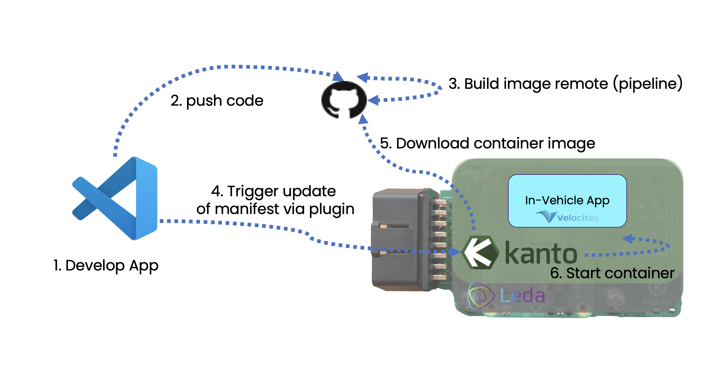
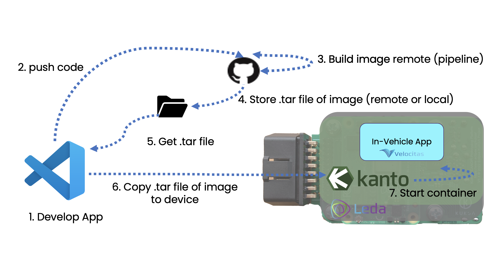
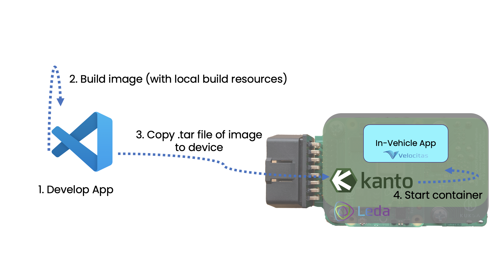

#  Introduction to LAD: Leda App Deployer

##  LAD: Leda App Deployer


LAD facilitates the installation of an Eclipse Velocitas App on a target device running Eclipse Leda (with Kanto). With LAD, three different deployment options called "STAGES" are selectable, to save time during Vehicle App development.


**NOTE:** The base requirement is to have one (or many) target device(s) which can be accessed from this source device via SSH. Each STAGE requires configurations on the source and/or the target system, which is described in the prerequisites of each STAGE. 

## Install the Extension in VSCode
LAD is not published on the official VSCode-Marketplace by now. You need to manually install the extension in VSCode by following these simple steps:

0. Install the VSCode Command Line Interface "code" if you have not done it earlier. To check if code is already installed, open a Terminal and type in ```code```.
If code is not present, do the following to install it:
	- Open the Command Pallette In VScode by pressing *Ctrl+Shift+P* on Windows or Linux or *Shift+⌘+P* on MacOS) 
	- On the Command Pallette, type 
	```
	Shell Command: Install 'code' command in PATH
	``` 
	... and hit enter after granting the necessary permissions for VSCode. This will add the `code` command to your system's PATH, allowing you to use it in the command prompt or PowerShell.
   
1. Download the **.vsix** file for the extension via cURL by opening a Terminal and running:
	```
	curl -o leda-app-deployer.vsix -L https://github.com/eclipse-leda/leda-contrib-vscode-extensions/releases/download/0.0.1/leda-app-deployer.vsix
	```
	alternative: Manually download the .vsix file  from the latest release on this repository
	 
2.  Install the extension via code with the following by running:
	```
	code --install-extension leda-app-deployer.vsix
	```
	
After successful installation, LAD is now visible in VSCode as an extension button that looks like a target ◎.

##  Three different Ways (called "STAGES") to deploy your Application

###  STAGE 1: The Remote Build

**Description:**

Use this STAGE to install Velocitas App images on a target device from a remote source. Images refer to the available images in the GitHub repositories' registry (ghcr) your application is pulled from. The target system automatically downloads the specified image from the remote GitHub Repository with the help of LAD. You can choose between the different image releases available for your Repository via dropdown.

**Prerequisites:**

-  Internet connection on both the source and target device.
-  If the source GitHub Repository (ghcr) is private: Authenticate ghcr on the target system by referring to "Authenticate private ghcr on the target device".

  

**The process:**




**Detailed steps the extension performs for you:**

1.  Connects to the target device via SSH.
2.  Checks if local-registries are set in Kanto config:
	-  Checks the `/etc/container-management/config.json` file.
	-  Examines the `registry_configurations` object.
3.  Generates a string and inserts it into the Kanto Manifest.
4.  Copies the Manifest to the target device via SCP.

  

###  STAGE 2: The Hybrid Build

  

**Description:**

Use this STAGE to first download the Velocitas App image from the web (or specify a local path to a .tar file) and then transfer it to the target system via a local network. The target system does not require an Internet connection. If a local path is specified, the source device does not require an internet connection as well.

**Prerequisites:**

-  Local registry on the target device: Allow the use beforehand by referring to the section "Add the local registry on the target device".

  

**The process:**



  

**Detailed steps the extension performs for you:**

1.  Connects to the target device via SSH.
2.  Checks if local-registries are set in Kanto Config:
	-  Checks the `/etc/container-management/config.json` file.
	-  Examines the `registry_configurations` object.
3.  Downloads tar source or reference from the local device.
4.  Copies the Tarball to the Leda Device via SCP.
5.  Executes the containerd imports.
6.  Generates a string and inserts it into the Manifest.
7.  Copies the Manifest to the Leda Device via SCP.

  

###  STAGE 3: The Local Build

  

**Description:**

Use this STAGE to build the Velocitas App image locally via Docker build. The deployment is completely done on a local network, so no internet connection is required, neither on the source device nor on the target device.

  

**Prerequisites:**

-  Docker: Docker must be installed on the source device where the image is built.
-  Dockerfile: A valid Dockerfile must be present in the project's structure.
-  Local registry on the target device: Allow the use beforehand by referring to the section "Add the local registry on the target device".

  

**The process:**



  

**Detailed steps the extension performs for you:**

1.  Builds Docker Image (checks included).
2.  Exports it as a Tarball (to `.vscode/tmp/*.tar`).
3.  Connects to the device via SSH.
4.  Checks if local-registries are set in Kanto Config:
	-  Checks the `/etc/container-management/config.json` file.
	-  Examines the `registry_configurations` object.
5.  Copies the Tarball to the Leda Device via SCP.
6.  Executes the containerd imports.
7.  Generates a string and inserts it into the Manifest.
8.  Copies the Manifest to the Leda Device via SCP.


##  Device Handling

###  Add, remove & edit target devices; run apps on the device

-  **Add and delete target devices:**

	-  If no target devices have been created yet, this can be done via the "+" button.
	-  To do this, the required information is entered in the prompt that opens.
	-  Once a target device has been created, it can be deleted using the trash can button.

  

-  **Change a previously created target device and do further settings:**

	-  Changes are possible via the pencil icon.
	-  The workspace config file then opens with the existing devices. Data can be further adjusted here.
	-  After saving and clicking the reload button, the changes are displayed and effective.


-  **Deploy apps on devices using LAD:**

	-  To deploy a Velocitas App with LAD, you can choose between the three variants described above:
	-  The cloud icon without an arrow executes STAGE 1 option 
		"Deploy remote built image remote".
	-  The cloud with the arrow executes STAGE 2 option 
		"Deploy local built image remote".
	-  The document icon with the arrow executes STAGE 3 option 
		"Deploy local built image local".

###  Add the local registry on the target device

**Edit Kanto's `config.json` in the Kanto container-management of the target system/device:**

1.  Navigate into the directory: `cd /etc/container-management`.
2.  Alter Kanto config: `vi config.json`.
3.  Add the following section if it is not already there: `"containers":{}`.
4.  After that or in case there is already the "containers" section, just add into that section: 
	"insecure-registries": ["localhost:5000"]
5.  Restart the cm-service with: `sudo systemctl restart container-management.service`.

###  Authenticate private ghcr on the target device

**Edit Kanto's `config.json` in the Kanto container-management of the target system/device:**

1.  Navigate into the directory: `cd /etc/container-management`.
2.  Edit Kanto config: `vi config.json`.
3.  Add the following section if it is not already there: `"containers":{}`.
4.  After that or in case there is already the "containers" section, just add into that section:
	  "registry_configurations": {
		"ghcr.io": {
			"credentials": {
				"user_id": "GITHUB USERNAME",
				"password": "GITHUB PASSWORD"
				}
			}
		}

## Further resources 
If we install kanto-cm on top of another OS (eg. Raspbian arm64), we have the following dependencies: 
- containerd.io
- eclipse mosquitto 
- https://github.com/eclipse-leda/leda-utils/releases

These dependencies include the container runtime, the MQTT Broker and further utils from the kanto environment like kanto UI or the kanto auto deployer. This one should be installed as a system service -> `resources/kanto-auto-deployer.service`.
